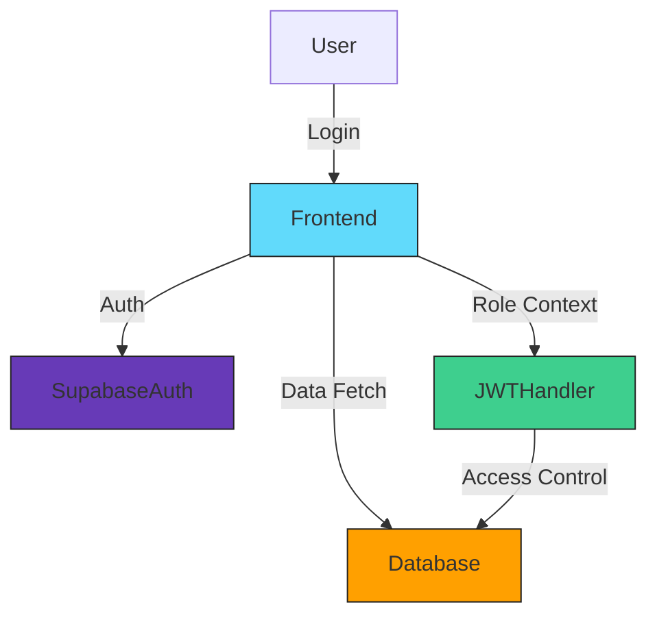

<!-- HEADER BANNER -->

<p align="center">

</p>

<p align="center">
  <a href="https://ashbrick.vercel.app" target="_blank">
    
  </a>
  
  
</p>

---

<p align="center" style="font-size:1.3em">
  <strong>🏗️ AshBrick: Connecting Buyers, Suppliers & Admins in the Brick Trade</strong><br>
  <em>A full-stack B2B platform for seamless procurement, order management, and supply-chain visibility—powered by Supabase.</em>
</p>

---

## 🌍 About the Project

**AshBrick** is a smart procurement and supply-chain management platform tailored for the construction industry, enabling:

* Buyers to explore and order construction materials.
* Suppliers to list, manage, and fulfill orders.
* Admins to control users, approve listings, and oversee analytics.

Built with **React**, **Tailwind CSS**, and **Supabase**, AshBrick provides a fast, secure, and scalable solution to modernize how brick and material trade operates in India and beyond.

---

## 🔒 Role-Based Access System (RBAC)

AshBrick features secure, role-based authentication powered by **Supabase Auth** and custom JWT claims. There are three roles:

* **Buyer**: Can browse products, place orders, and track deliveries.
* **Supplier**: Can list products, update inventory, and fulfill orders.
* **Admin**: Can manage users, approve suppliers, and monitor operations.

---

## 📊 Features

* 🌍 **Buyer Dashboard** with cart, filters, past orders.
* 🚚 **Supplier Panel** to manage products & inventory.
* 🧱 **Admin Control Center** to approve suppliers and monitor activity.
* 🔑 **JWT-based Role Authorization** for protected routes.
* ✅ **Login/Logout** using **Supabase's email-based OTP login**.
* 💡 **Modular Component Structure** with clean UI using Tailwind.

---

## 🔧 Tech Stack

|     Frontend    |    Backend & Auth    |  Database & Hosting  |
| :-------------: | :------------------: | :------------------: |
| ⚛️ React (Vite) |   🟢 Supabase Auth   | 📃 Supabase Postgres |
| 🎨 Tailwind CSS | 🔐 JWT Role Handling | ☁️ Vercel Deployment |

---

## 🛂 System Architecture




---

## 📸 Screenshots

Coming Soon... *(Include your homepage, buyer dashboard, supplier panel, admin controls)*

---

## 🌐 Folder Structure

```bash
ashbrick/
├─ src/
│  ├─ components/       # UI Components
│  ├─ pages/            # Page-level views
│  ├─ context/          # Auth & Role Context
│  ├─ lib/              # Supabase Client & Helpers
│  └─ styles/           # Tailwind Config
├─ public/
├─ .env.local           # Environment Variables
└─ README.md
```

---

## 🚀 Getting Started

```bash
# 1. Clone the repo
https://github.com/<your-username>/ashbrick.git

# 2. Install dependencies
npm install

# 3. Add .env.local
SUPABASE_URL=...
SUPABASE_ANON_KEY=...

# 4. Run locally
npm run dev
```

---

## 📊 Database Schema (Supabase)

* **users**: id, email, role
* **products**: id, title, price, category, description, image
* **orders**: id, buyer\_id, product\_id, status, quantity
* **suppliers**: id, user\_id, approved

---

## 💡 APIs & Routes

* `/api/login` – Supabase OTP sign-in
* `/products` – GET all products
* `/orders` – Create/view orders (based on role)
* `/admin` – Role-protected admin actions

---

## 🛡️ Security

* Role-based protected routes via Context + Supabase Session
* Server-side checks for actions like order placement, approval
* JWT tokens signed & validated by Supabase Auth

---

## 📊 Future Scope

* Add chat between buyer & supplier
* Use LLM (GPT-4) to recommend materials based on queries
* Add SMS/Email order notifications
* Analytics Dashboard for Admins

---

## 📄 Contributors 


