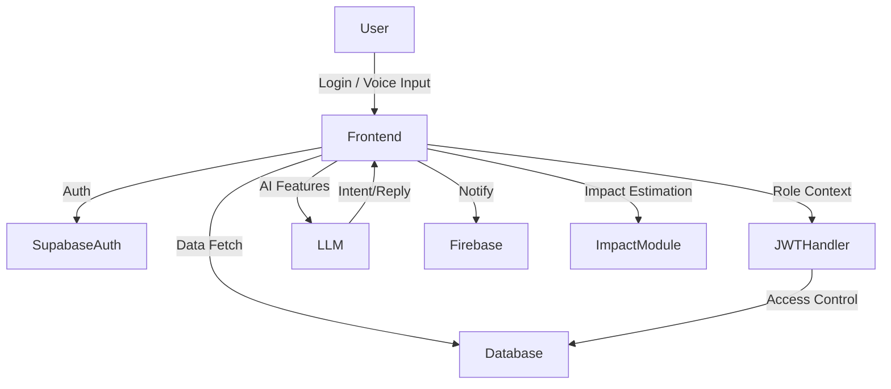

<!-- HEADER BANNER -->
<p align="center">

</p>

<p align="center">
  
  
  
  
</p>

---

<div align="center">

<p style="font-size:1.6em; font-family:'Arial', sans-serif; line-height:1.8; margin: 2em 0;">
  <strong>🏗️ AshBrick: Connecting Buyers, Suppliers & Admins in the Brick Trade</strong><br>
  <em>A full-stack B2B platform for seamless procurement, order management, and supply-chain visibility—powered by Supabase and AI.</em>
</p>

[](https://ashbrick.vercel.app)
[](https://github.com/CodePhoenix/ashbrick)

</div>


## 🌍 **About the Project**

**AshBrick** is a smart procurement and supply-chain management platform tailored for the construction industry, enabling:

* 🔋 **Power Plants** to find buyers for toxic fly ash (saving ₹500/ton disposal costs)
* 🏭 **Brick Makers** to source quality fly ash and manage inventory
* 🏗️ **Construction Companies** to access eco-friendly bricks at competitive prices
* 🤖 **AI-Powered Intelligence** for optimal matching, predictions, and negotiations

Built with **React**, **Tailwind CSS**, **Supabase**, and cutting-edge **AI technology**, AshBrick provides a fast, secure, and scalable solution to modernize how brick and material trade operates in India and beyond.

---

## 📸 **Screenshots**

<p align="center">
  
  &nbsp;
  
</p>

---

## 🤖 **AI Features Overview**

### 🤖 **AI Matchmaking Assistant**

* **What it does**: Like a dating app for fly ash! Finds best plant-factory matches based on distance, quality, pricing.
* **Tech Used**:
  * **Llama LLM** for natural language queries
  * **Agentic AI** for deal negotiation automation

### 🔮 **Smart Supply Predictor**

* **What it does**: Forecasts ash availability and demand trends.
* **Tech Used**:
  * **ML Models** (scikit-learn)
  * Power plant data + permit data

### 📄 **Instant Report Generator**

* **What it does**: Auto-generates ESG, compliance, and contract reports.
* **Tech Used**:
  * Llama-powered **Generative AI**
  * Prebuilt dynamic templates

### 🗣️ **Voice Chat Helper**

* **What it does**: Talk to the app! Commands like "Find cheap ash near Delhi."
* **Tech Used**:
  * **Speech Recognition**
  * **Llama LLM** for NLP

### 📊 **Smart Deal Advisor**

* **What it does**: Recommends negotiation changes ("Add 5% discount for early pay")
* **Tech Used**:
  * **Reinforcement Learning** + Agentic AI

---


## 🔄 **Full Conversation Flow Example**

**Raj (Plant Manager)**

🎤 *"List 500 tons ash from Mumbai plant"*

**AI Assistant**

💬 *"Listing created! Quality score 92%. I've found 4 buyers nearby. Top match: EcoBricks needs 200 tons. Should I negotiate?"*

**Raj**

🖱️ *Clicks "Start Negotiation"*

**AI Agent (Plant)**

🤖 *"We offer 200 tons at ₹170. Free loading included."*

**AI Agent (Factory)**

🤖 *"Can do ₹160 if you cover transport permits."*

**AI Mediator**

💡 *"Compromise: ₹165/ton with shared permits. Deal?"*

**Both**

✅ *Click "Accept"*

**System**

📢 *"Deal closed! Truck dispatched. Estimated CO₂ savings: 15,000 kg 🌱"*

---

## 🛠️ **Tech Stack**

### **AI Features & Requirements**

<div align="center">

| AI Feature        | Requirements              | Difficulty |
|:-----------------:|:-------------------------:|:----------:|
| Matchmaking       | Llama 7B, basic logic     | Easy 🟢    |
| Prediction Engine | Python, scikit-learn      | Medium 🟡  |
| Report Generator  | jsPDF + LLM templates     | Easy 🟢    |
| Voice Chat        | Browser mic + Llama       | Medium 🟡  |
| Deal Advisor      | LangChain + prebuilt bots | Hard 🔴    |

</div>

### **Technology Stack**

<div align="center">

|     Frontend    |    Backend & Auth    |  Database & Hosting  |      AI & ML      |
|:---------------:|:-------------------:|:-------------------:|:-----------------:|
| ⚛️ React (Vite) |   🟢 Supabase Auth   | 📃 Supabase Postgres | 🤖 Llama 7B LLM   |
| 🎨 Tailwind CSS | 🔐 JWT Role Handling | ☁️ Vercel Deployment | 🧠 LangChain      |
| 🗺️ Leaflet Maps | 🔑 Role-Based Access | 🔄 Real-time Sync   | 📊 Scikit-learn   |

</div>

---

## 🏆 **Environmental Impact**

<div align="center">

| 🌍 **CO₂ Emissions** | 💧 **Water Usage** | 🌱 **Land Damage** |
|:-------------------:|:-----------------:|:-----------------:|
| 0.18 kg/brick → 0.03 kg/brick<br><span style="color:green;">**83% ↓**</span> | 1.2 L/brick → 0.6 L/brick<br><span style="color:green;">**50% ↓**</span> | Topsoil depletion → None<br><span style="color:green;">**100% ↓**</span> |

</div>

> <b>Every 10M bricks:</b> 🌍 <b>1.5M kg CO₂ saved</b> | 💧 <b>6M liters water saved</b> | 🏭 <b>2,500 tons toxic ash utilized</b>

---

## 🚢 **System Architecture**



---

## 🔒 **Role-Based Access System (RBAC)**

AshBrick features secure, role-based authentication powered by **Supabase Auth** and custom JWT claims. There are three roles:

* **🔋 Buyer**: Can browse products, place orders, and track deliveries.
* **🏭 Supplier**: Can list products, update inventory, and fulfill orders.
* **👨‍💼 Admin**: Can manage users, approve suppliers, and monitor operations.

---

## 📊 **Features**

* 🌍 **Buyer Dashboard** with cart, filters, past orders.
* 🚚 **Supplier Panel** to manage products & inventory.
* 🧱 **Admin Control Center** to approve suppliers and monitor activity.
* 🔑 **JWT-based Role Authorization** for protected routes.
* ✅ **Login/Logout** using **Supabase's email-based OTP login**.
* 💡 **Modular Component Structure** with clean UI using Tailwind.
* 🤖 **AI-Powered Matching** for optimal supplier-buyer connections.
* 🔮 **Predictive Analytics** for demand forecasting.
* 📄 **Automated Report Generation** for ESG compliance.
* 🗣️ **Voice Interface** for hands-free operation.

---

## 🌐 **Folder Structure**
```bash
AshBrick/
├─ ashbrick/                         # 🌐 Frontend (React + Supabase)
│  ├─ node_modules/
│  ├─ public/                        # Static public assets
│  ├─ src/
│  │  ├─ components/                 # 💡 Reusable UI Components
│  │  │   ├── Hero.jsx              # 🎯 Landing page hero section
│  │  │   ├── Features.jsx          # ⚡ Core features showcase
│  │  │   ├── AIFeatures.jsx        # 🤖 AI capabilities demo (Voice/AI assistant)
│  │  │   ├── Impact.jsx            # 🌍 Environmental impact metrics
│  │  │   ├── Metrics.jsx           # 📊 Key performance indicators
│  │  │   ├── CTA.jsx               # 📞 Call-to-action sections
│  │  │   ├── Navbar.jsx            # 🧭 Navigation component
│  │  │   ├── Footer.jsx            # 🦶 Footer component
│  │  │   └── BackgroundBlobs.jsx   # ✨ Animated background
│  │  ├─ pages/                     # 📄 Route-level pages
│  │  ├─ context/                   # 🔐 Auth & Role Contexts
│  │  │   ├── AuthContext.jsx       # Supabase auth context
│  │  │   └── RoleContext.jsx       # Buyer/Supplier/Admin role handler
│  │  ├─ lib/                       # ⚙️ Supabase client and utilities
│  │  │   └── supabase.js
│  │  ├─ assets/                    # 🎨 Static images, icons, etc.
│  │  ├─ styles/                    # 🎨 Tailwind & global styles
│  │  ├─ App.jsx                    # 🚀 Main App component
│  │  └─ main.jsx                   # ⚡ Entry point
│  ├─ .env.local                    # 🔐 Supabase API Keys, etc.
│  ├─ .gitignore
│  ├─ eslint.config.js
│  ├─ postcss.config.js
│  ├─ tailwind.config.js
│  ├─ package.json
│  ├─ package-lock.json
│  └─ README.md

├─ server/                           # ⚙️ Backend (Node.js + Express + PostgreSQL)
│  ├─ node_modules/
│  ├─ controllers/                  # 🧠 Business logic (e.g., auth, tokens)
│  │   └── authController.js
│  ├─ routes/                       # 🛣️ Express routes
│  │   └── authRoutes.js
│  ├─ middleware/                   # 🧱 Auth middlewares (JWT, role checks)
│  │   └── verifyToken.js
│  ├─ db/                           # 🗄️ DB config & SQL queries
│  │   ├── config.js                # PostgreSQL connection setup
│  │   └── queries.js               # Parameterized SQL queries
│  ├─ .env                          # 🔐 Backend env vars (DB URL, JWT secret)
│  ├─ .gitignore
│  ├─ server.js                     # 🚀 Entry point for Express server
│  ├─ package.json
│  └─ package-lock.json
```
---

## 📊 **Database Schema (Supabase)**

* **users**: id, email, role
* **products**: id, title, price, category, description, image
* **orders**: id, buyer_id, product_id, status, quantity
* **suppliers**: id, user_id, approved

---

## 💡 **APIs & Routes**

* `/api/login` – Supabase OTP sign-in
* `/products` – GET all products
* `/orders` – Create/view orders (based on role)
* `/admin` – Role-protected admin actions

---

## 🛡️ **Security**

* Role-based protected routes via Context + Supabase Session
* Server-side checks for actions like order placement, approval
* JWT tokens signed & validated by Supabase Auth

---

## 👥 **Meet the Team**

<table>
  <tr>
    <td align="center">
      <a href="https://www.linkedin.com/in/aashi-goel-041512295" target="_blank">
        <br>
        <b style="font-size:18px; color:#333;">Aashi Goel</b>
      </a>
    </td>
    <td align="center">
      <a href="https://www.linkedin.com/in/disha-prajapati-06681a311/" target="_blank">
        <br>
        <b style="font-size:18px; color:#333;">Disha Prajapati</b>
      </a>
    </td>
    <td align="center">
      <a href="https://www.linkedin.com/in/gagan-singh-145781321" target="_blank">
        <br>
        <b style="font-size:18px; color:#333;">Gagan Singh</b>
      </a>
    </td>
  </tr>
</table>

---

## 🚀 **Getting Started**

```bash
# 1. Clone the repo
git clone https://github.com/<your-username>/ashbrick.git

# 2. Install dependencies
npm install

# 3. Add .env.local
SUPABASE_URL=...
SUPABASE_ANON_KEY=...

# 4. Run locally
npm run dev
```

Open your browser at `http://localhost:5173`

---

## 💸 **Business Model**

<div align="center">

| 💰 **Transaction Fee** | 📊 **SaaS Subscription** | 🌱 **Carbon Services** |
|:---------------------:|:------------------------:|:---------------------:|
| 7% on ash sales<br>₹200/ton avg | Premium analytics<br>₹15k/month | Credit commission<br>15% on sales |

</div>

> <b>Market Size:</b> 🏭 300+ coal plants → 250M tons ash/year | 🏗️ ₹9.2T construction industry | 🚫 163 cities banned clay bricks

---

## 🗺️ **Roadmap**

<div align="center">

| ✅ **Phase 1: MVP** | 🚧 **Phase 2: AI** | 🔮 **Phase 3: Advanced** |
|:------------------:|:-----------------:|:----------------------:|
| Interactive map<br>Matching<br>CO₂ calculator<br>Responsive UI | Llama LLM<br>Predictive dashboard<br>Agentic negotiation<br>Voice interface | Blockchain quality<br>IoT sensors<br>Carbon marketplace<br>Mobile apps |

</div>

---

## 📞 **Contact**

<div align="center">

[](https://www.linkedin.com/in/aashi)
[](mailto:team@ashbrick.tech)
[](https://ashbrick.vercel.app)

</div>

---

<div align="center">

## **Built with ❤️ for a Sustainable Future**

[](https://reactjs.org/)
[](https://openai.com/)
[](https://un.org/sustainabledevelopment/)

**🌟 Join us in building a greener tomorrow! 🌟**

</div>
